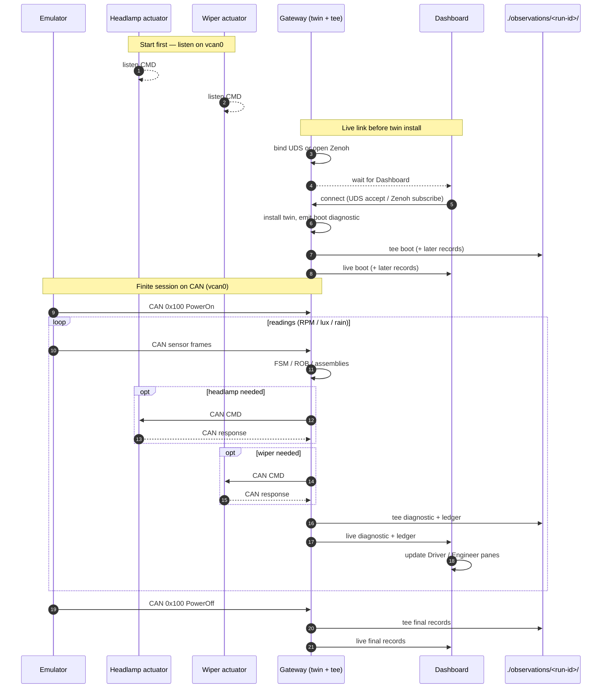
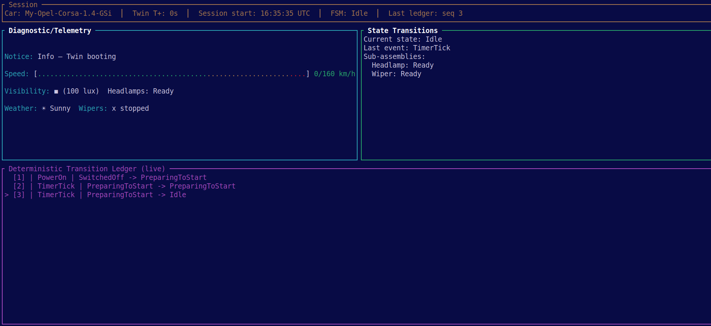
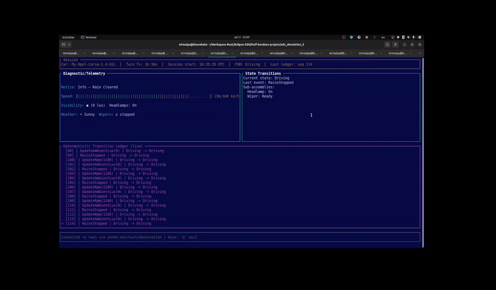
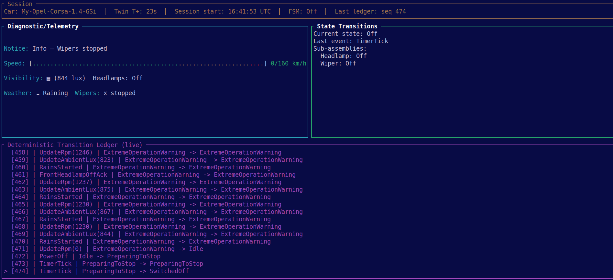

# SDV Simulation 5 — Multi-process observation & Dashboard

---

↩️ This repo is **Iteration 5** of a software-defined-vehicle (#SDV) prototype. Each iteration
**grows on its predecessor** — reusing and refactoring what still fits, and changing structure
where the next goal requires it.

| Iteration | Repository | Focus |
| --------- | ---------- | ----- |
| 1 | [`sdv_simulation_1`](https://github.com/nsengupta/sdv_simulation_1) | First working CAN control loop |
| 2 | [`sdv_simulation_2`](https://github.com/nsengupta/sdv_simulation_2) | Zone contexts, transition ledger, diagnostics |
| 3 | [`sdv_simulation_3`](https://github.com/nsengupta/sdv_simulation_3) | Headlamp twinlet, quiescent commit |
| 4 | [`sdv_simulation_4`](https://github.com/nsengupta/sdv_simulation_4) | Brain FSM redesign, ROB, Wiper twinlet |
| **5** | **`sdv_simulation_5` (this repo)** | **Gateway/Dashboard split, observation files + live UDS\|Zenoh, Dashboard presentation, weather/wiper on ledger** |

Iteration 4 twin / ROB design (still the coordination core):  
[`docs/archive/DESIGN-iteration-4.md`](docs/archive/DESIGN-iteration-4.md).

---

## What this repository contains

A **multi-process SDV prototype** on Linux CAN (`vcan0`):

| Process | Crate | Owns |
|---------|-------|------|
| Gateway | `gateway` | Digital twin, CAN ingress, actuation, observation file tee, optional live publish |
| Dashboard | `tui_dashboard` | Observation-only TUI (driver / engineer / ledger tail) |
| Emulator | `emulator` | Finite or Ctrl+C CAN lifecycle + RPM / lux / rain |
| Actuators | `front_headlamp_actuator`, `wiper_actuator` | CMD responses on CAN |

Shared library: `common` (twin, FSM, published records). Persistence / live wire: `observation`
(schema **v3** JSON envelopes).

**This README is the source of truth** for what the repo is and how to run it. Narrative /
blog drafts live under [`blog-inputs/`](blog-inputs/) and are accompanying text only.

---

## What Iteration 5 added (over 4)

1. **Gateway** 
    * Owns the Digital Twin (Actors/FSM/Diagnostic Emitter/Transition Ledger Emitter)
    * Connects to either a Unix Domain Socket or a Zenoh peer (based on a command-line parameter), using a given Key-Expression and 
      emits records
    * Stores the Ledger in local files as well ( _tee_ mechanism ); readiness for 'replaying 
      logs facility' in future simulations
2. **Dashboard**
   * #ratatui-based TUI application; having separate panes for displaying Diagnostics, 
     Transition and Ledger-stream
   * Works as the Observation console
2. **Observation capture and emission**
    * Dashboard uses versioned `manifest.json` + `diagnostic.jsonl` + `ledger.jsonl` emitted by 
      Gatway; transportation takes place through Unix Domain Socket or Zenoh (peer mode)
    * Dashboard displays the records captured, _live_ 
    * Dashboard panes present Speed Bar, weather/wiper/visibility glyphs, Transition Ledgers
    * Diagnostics pane is meant for Drivers; Transition Ledger is meant for Engineers, watching 
      behaviour of the Digital Twin
3. **Controlled CAN data generation by emulator**
    * Can emit N records (`--readings`); optional `--tick-ms` (default 100) slows ticks for demos
    * Ensures that Digital Twin receives a `PowerOn` before any emulated CAN message and a `PowerOff` as 
      the last emulated CAN message

Roadmap and deferred gaps: [`docs/PLAN.md`](docs/PLAN.md).  
Design decisions (this simulation): [`docs/DESIGN.md`](docs/DESIGN.md).  
Topology / gap register: [`docs/ARCHITECTURE-OVERVIEW.md`](docs/ARCHITECTURE-OVERVIEW.md).

---

## How to run (manual smoke)

```bash
# Terminals — start actuators, then Gateway, then Dashboard, then emulator:
cargo run -p front_headlamp_actuator
cargo run -p wiper_actuator
cargo run -p gateway -- --uds observation.sock
cargo run -p tui_dashboard -- --uds observation.sock
EMULATOR_TUNNEL_PROB=0.01 EMULATOR_RAIN_PROB=0.008 \
  cargo run -p emulator -- --readings 30

# Optional: slow ticks for demos (default --tick-ms 100):
#   cargo run -p emulator -- --readings 30 --tick-ms 400
```

UDS paths resolve under `<cwd>/tmp/` (e.g. `./tmp/observation.sock`).

**Zenoh peer** (instead of UDS):

```bash
cargo run -p gateway -- --zenoh --keyexpr sdv/twin/observation
cargo run -p tui_dashboard -- --zenoh --keyexpr sdv/twin/observation
```

**Headless capture** (files only): `cargo run -p gateway -- --no-live`  
Runs land under `./observations/<run-id>/`.

Smoke scripts: `scripts/smoke-two-process.sh`, `scripts/smoke-zenoh-peer.sh`.

---

## Architecture (short)

```text
Emulator ──CAN──► Gateway (twin + ObservationTee) ──files──► ./observations/<run-id>/
                      │
                      ├── live UDS or Zenoh ──► Dashboard (TUI)
                      └── CAN CMD ◄──► Headlamp / Wiper actuators
```



- Library pyramid L0–L6: `common` is acyclic; Gateway/Dashboard import `common::facade` only
  for twin types. Detail: [`docs/design-notes-pyramid-layers.md`](docs/design-notes-pyramid-layers.md).
- Observation schema mirrors **published** Rust structs (currently **v3**: weather + wiper +
  real rain events).
- Twin still uses the Iteration-4 **ROB** (`barrier_queue`) and PreparingToStart/Stop lifecycle
  — see archived Iter 4 design and [`diagrams/`](diagrams/).

---

## Assembly actors (L1 state transitions)

Both assemblies are peers in the Brain (ROB, tell-back, PreparingToStart/Stop). Headlamp uses
hardware ACK on lux-driven on/off; Wiper is fire-and-forget on rain Start/Stop. Lifecycle
`BecomeOff` is **deliberately incomplete** on both: jump to `Off` with no physical stop CMD
(`RequestOff` / `StopWiping`). Source of truth: `crates/common/src/vehicle_state/{front_headlamp,wiper}.rs`.

### Headlamp

```text
Lifecycle (Brain Actor issues StartAssemblies / StopAssemblies):

                   BecomeOn
         Off ──────────────────► Ready
          ▲                        │
          │                        │ BecomeOff (any → Off;
          └────────────────────────┘  no RequestOff)

Operational (lux + hardware ACK — assembly stays “up”):

  Ready ──lux≤ON──► OnRequested ──AckOn──► On
    ▲                   │                   │
    │                   │ incomplete/       │ lux≥OFF
    │                   │ timeout           ▼
    │                   |         OffRequested ──AckOff──► Ready
    │───────────────────┘                       │
    │                                           │ incomplete/timeout
    └───────────────────────────────────────────┘ (back to On)
```

### Wiper

```text
                   BecomeOn
         Off ──────────────────► Ready ─────── Start ───────► Running
          ▲                        │  ▲                          │
          │                        │  └──────── Stop ────────────┘
          │                        │              (RainsStopped) │
          │                        │                             │
          └──── BecomeOff ─────────┴────── BecomeOff ────────────┘
                (any → Off;                (any → Off;
                 no StopWiping)             no StopWiping)

Operational Start/Stop emit StartWiping/StopWiping (→ CAN CMD, no ACK).
```

---

## Dashboard reflects the Twin

The Dashboard is observation-only: every pane is driven by what the Twin publishes
(diagnostics + ledger), not by a parallel UI model. The same surfaces show the Twin
**just after start** and **after PowerOff** — only the published state changes.

### At start (Twin Idle after PowerOn)

Session / Driver / Engineer / ledger all agree: FSM `Idle`, assemblies `Ready`, boot notice,
ledger through PreparingToStart → Idle.



### Live (mid-session)



### At end (Twin Off after PowerOff)

Same layout; Twin has shut down: FSM `Off`, Headlamp/Wiper `Off`, ledger ends PreparingToStop →
SwitchedOff. Weather/wiper glyphs still come from the last published context.



---

## Dashboard surfaces

| Pane | Shows |
|------|--------|
| Driver (Diagnostic) | Notice, speed bar, visibility (+ lux glyph), weather/wiper glyphs + text |
| Engineer | Current state, last event, Headlamp / Wiper assembly context |
| Ledger tail | Last 20 transition hops (`>` on newest) |

---

## Tests

```bash
cargo test -p common -p observation -p gateway -p tui_dashboard -p emulator
```

Contract tests under `crates/common/src/test/`; observation goldens under
`crates/observation/testdata/golden/v3/`.

---

## Project structure

```text
sdv_simulation_5/
├── Cargo.toml                 # Workspace root
├── README.md
├── assets/
│   └── dashboard-live.gif     # README live TUI capture
├── blog-inputs/               # Stage narratives (accompanying prose)
├── diagrams/                  # Mermaid + Dashboard start/end screenshots
├── scripts/
│   ├── smoke-two-process.sh   # Gateway + UDS + emulator
│   ├── smoke-zenoh-peer.sh
│   └── check-gateway-facade-imports.sh
├── docs/
│   ├── PLAN.md                # Roadmap + TBDs
│   ├── DESIGN.md              # Stage 5 decisions
│   ├── ARCHITECTURE-OVERVIEW.md
│   ├── TODO-*.md
│   └── archive/               # Iter 4 DESIGN, detailed PHASES, old specs/plans
├── observations/              # Runtime capture output (gitignored runs)
└── crates/
    ├── common/                # Twin, FSM, ROB, assemblies, published records, facade
    ├── observation/           # Schema DTOs, RunWriter/Reader, tee, UDS/Zenoh live
    ├── gateway/               # Twin host, CAN, tee, live publish
    ├── tui_dashboard/         # Observation-only TUI
    ├── emulator/              # CAN lifecycle + RPM / lux / rain
    ├── vehicle_device_bus/    # Headlamp / wiper CAN codecs
    ├── front_headlamp_actuator/
    └── wiper_actuator/        # Fire-and-forget motor stand-in
```

Deeper `common` pyramid (L0–L5): [`docs/design-notes-pyramid-layers.md`](docs/design-notes-pyramid-layers.md), [`docs/project-structure.md`](docs/project-structure.md).

---

## Docs map

| Doc | Role |
|-----|------|
| **This README** | What the repo contains; how to run |
| [`docs/PLAN.md`](docs/PLAN.md) | Roadmap + important TBDs |
| [`docs/DESIGN.md`](docs/DESIGN.md) | Stage 5 design decisions |
| [`docs/ARCHITECTURE-OVERVIEW.md`](docs/ARCHITECTURE-OVERVIEW.md) | Topology, gaps, run notes |
| [`docs/archive/`](docs/archive/) | Historical design notes (Iter 4 twin, agent specs) |
| [`blog-inputs/`](blog-inputs/) | Narrative drafts (not repo truth) |
| [`docs/TODO-twin-lifecycle.md`](docs/TODO-twin-lifecycle.md) | Shutdown / disband checklist |
| [`docs/TODO-simulation-5.md`](docs/TODO-simulation-5.md) | Engineering backlog (actuation, tests, …) |

---

## TBD

Major future work (detail in [`docs/PLAN.md`](@/docs/PLAN.md)):

| Item | Compact plan |
|------|----------------|
| **Standalone replay** | Dashboard (or a new tool) plays `observations/<run-id>/` without a live Gateway. |
| **Shutdown / disband** | Quit → Stop → wait `Off` → tear down actors / ingress ([`docs/TODO-twin-lifecycle.md`](docs/TODO-twin-lifecycle.md)). |
| **Active ROB turns** | Engineer live `N` from `barrier_queue`; emit on queue push/drain (not ledger-hop stamps). |
| **Visibility `Swatch`** | Colour chips for lux bands (low / hold / bright) instead of unicode boxes alone. |
| **Notice colours** | Style Notice by `DiagnosticLevel` / kind (labels already cyan). |
| **Glyph ASCII / motion** | Optional ASCII fallback for weak terminals; optional wiper/weather animation. |
| **Richer assemblies** | Deeper Headlamp / Wiper twinlet detail once Twin publishes it. |
| **Headlamp unconfirmed** | Finish / relocate `HeadlampActuationUnconfirmed` (zone tell-back candidate). |
| **Non-blocking actuation** | Engineering backlog — async CMD path without stalling the twin loop ([`docs/TODO-simulation-5.md`](docs/TODO-simulation-5.md)). |
| **Zenoh as the router** | Currently, Zenoh is used in _peer_ more; it should be used as a Router |
